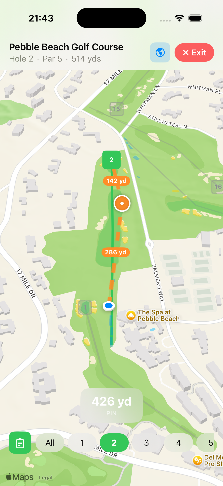
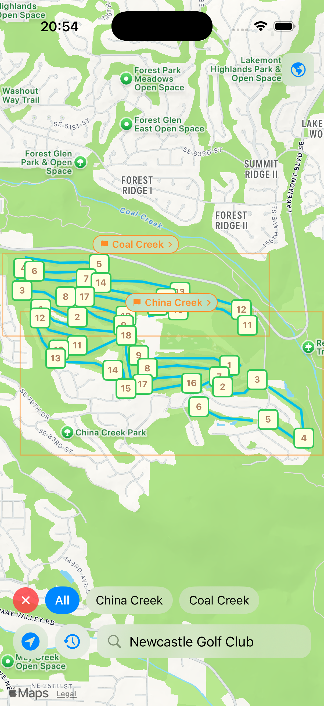
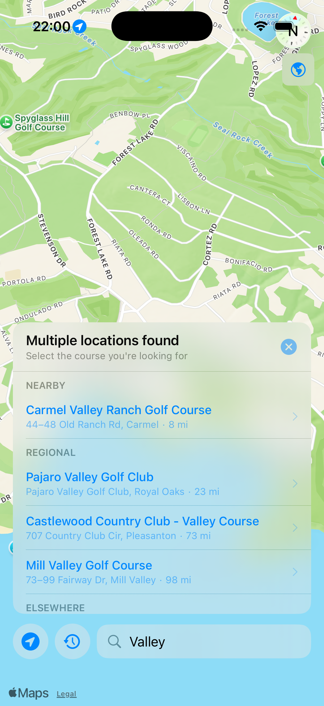
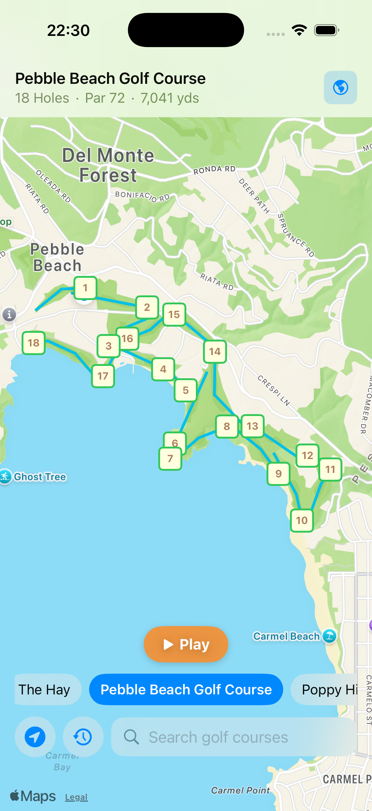
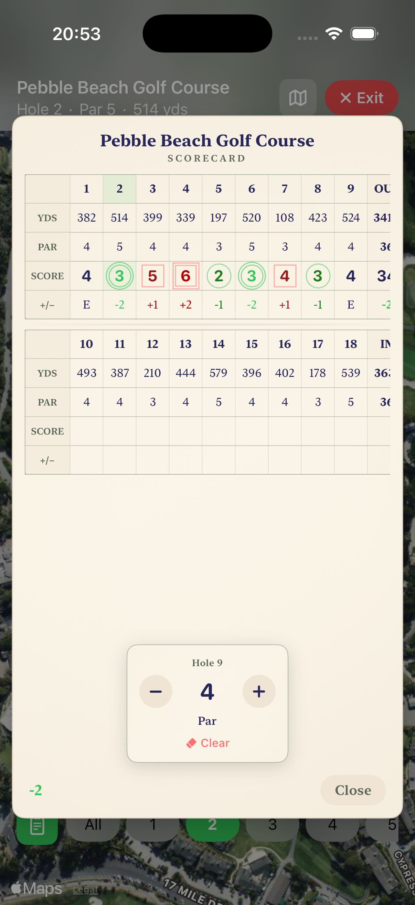
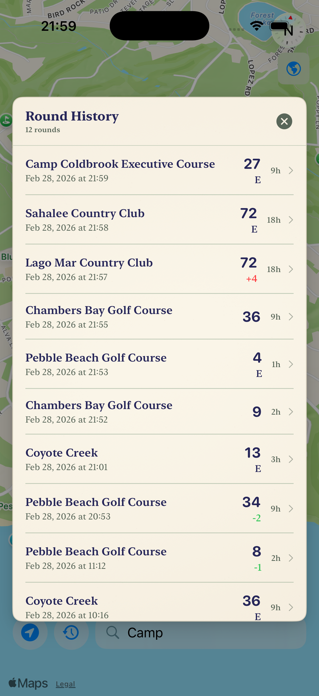

# Golfiasta

## Golf GPS, Scorecard & Satellite Map

Find any golf course, get live GPS distances, and track your scores — all on your phone. If you know how to use Apple Maps, you already know how to use Golfiasta. No tutorials, no sign-up screens, no learning curve. Just search, tap Play, and go.

  
  

---

## Find Courses Instantly

Search by name or tap the location button to discover courses near you. Golfiasta includes a bundled database of thousands of US courses so course data loads instantly — no waiting for a server. International courses are available online via OpenStreetMap.

  
  

---

## Live GPS on a Satellite Map

Select a course and tap Play — that's it. Every hole is displayed on a satellite map with tee boxes, fairways, greens, and bunkers rendered as color-coded overlays. See live yardage to the front, center, and back of the green, updated continuously as you move. Each hole view automatically aligns the camera to the tee-to-green bearing, so you see the hole the way you'd see it from the tee.

  
  

---

## Scorecard & Round History

Keep score as you play with a beautifully designed scorecard. Tap any hole to enter your score with a simple +/- stepper anchored to par. Birdies get circles, bogeys get squares — just like a real paper scorecard. Review all your past rounds with scores, par comparisons, and course details. Your round history syncs across your Apple devices via iCloud.

  
  

---

## No Subscription. No Ads.

Golfiasta is a one-time purchase. No monthly fees, no ads, no account required. Your data stays on your device and syncs securely via iCloud.

[Download on the App Store](https://apps.apple.com/us/app/golfiasta-golf-gps/id6760437254)

---

*Course layouts are derived from [OpenStreetMap](https://openstreetmap.org), available under the [Open Database License (ODbL)](https://opendatacommons.org/licenses/odbl). GPS distances are approximate and intended for informational purposes only.*
